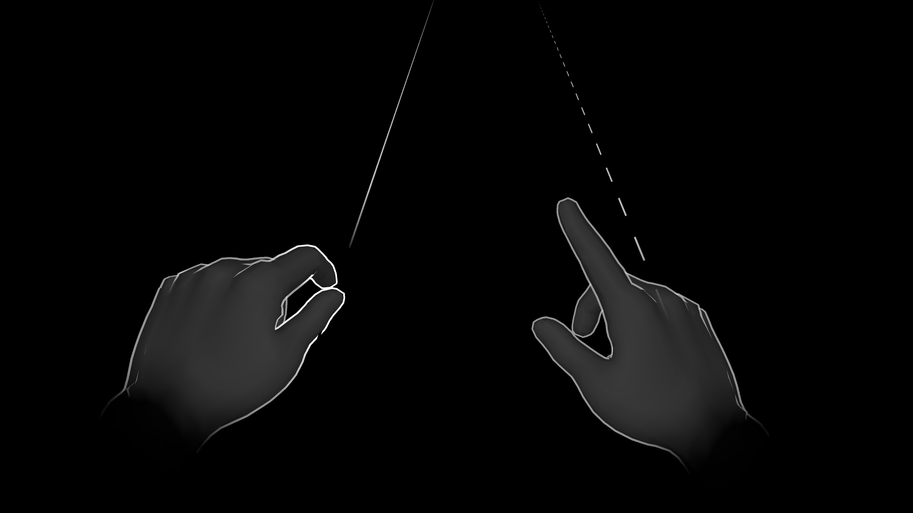
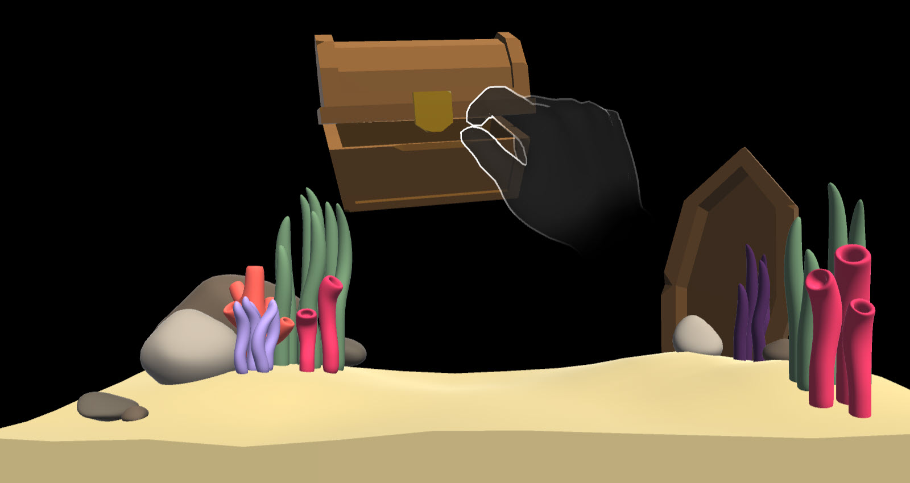
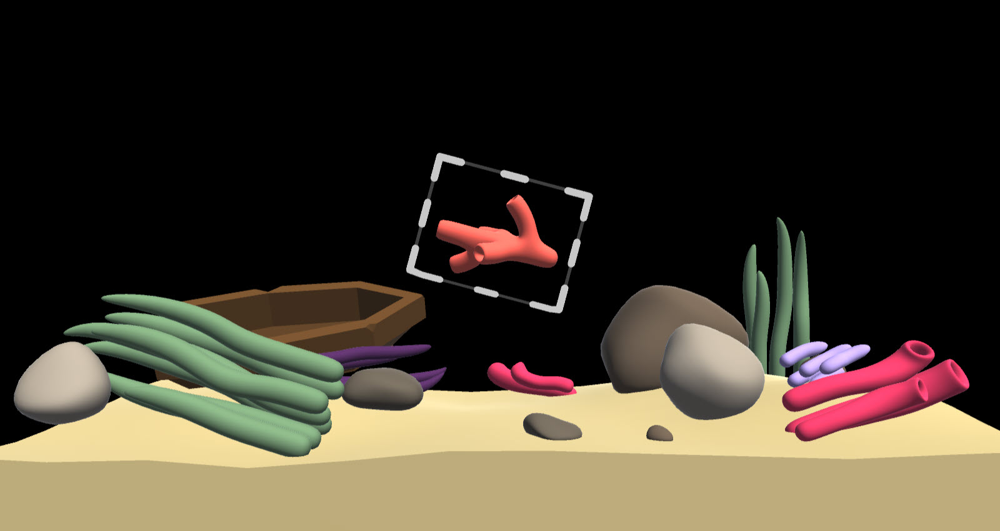
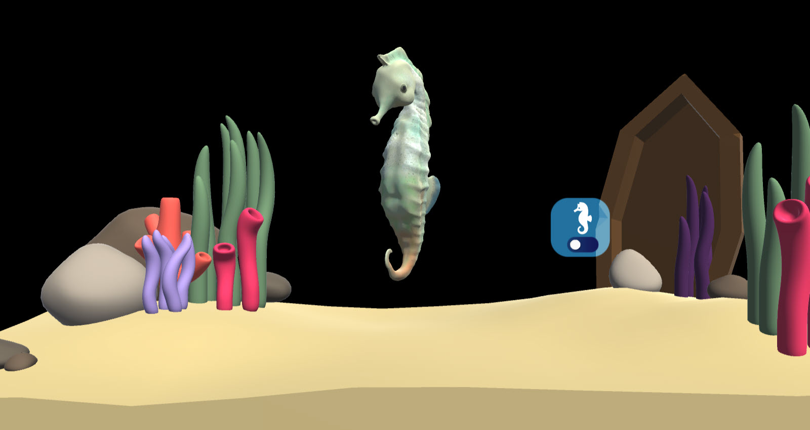
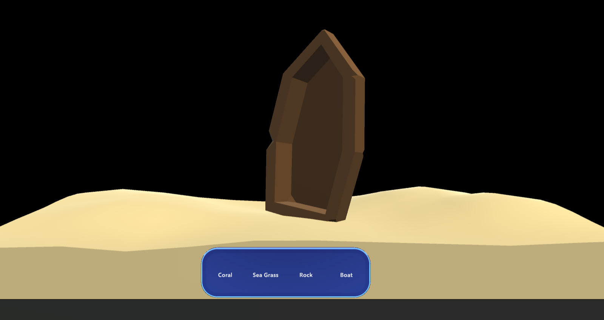

# Mixed Reality Toolkit 3 in-editor tutorials

The MRTK3 in-editor tutorials guide you through each step of the way to build your first MRTK3 application in a beautiful aquarium. 

## Getting Started with the MRTK3 in-editor tutorials

1. Install Unity 2021.3.4f1
1. Clone this repository to your computer.
1. Open the cloned project "MRTK3-iet-tutorials" with Unity 2021.3.4f1.
1. You should see a **Tutorials** window on the right side of your screen that contains a list of seven tutorials. If not, on the menu bar, select **Tutorial** > **Show Tutorials**.
1. In the **Tutorials** window, select the tutorial you want to proceed with.

## Tutorials

### Preview the Project

Learn about the various solutions for previewing scenes without compiling and deploying projects to a XR device.

### How to use MRTK Input Simulation

Learn how to simulate input directly into the Unity editor with MRTK In-Editor Input Simulation.

### Object Manipulator

Move and manipulate objects with one or two hands with a wide variety of input modalities.

### Bounds Control

Intent feedback and precision manipulation affordances.

### Canvas Button

A volumetric button optimized for a wide range of input modalities.

### Canvas Button bar

A volumetric button bar optimized for a wide range of input modalities.

## Contributing

This project welcomes contributions and suggestions.  Most contributions require you to agree to a
Contributor License Agreement (CLA) declaring that you have the right to, and actually do, grant us
the rights to use your contribution. For details, visit https://cla.opensource.microsoft.com.

When you submit a pull request, a CLA bot will automatically determine whether you need to provide
a CLA and decorate the PR appropriately (e.g., status check, comment). Simply follow the instructions
provided by the bot. You will only need to do this once across all repos using our CLA.

This project has adopted the [Microsoft Open Source Code of Conduct](https://opensource.microsoft.com/codeofconduct/).
For more information see the [Code of Conduct FAQ](https://opensource.microsoft.com/codeofconduct/faq/) or
contact [opencode@microsoft.com](mailto:opencode@microsoft.com) with any additional questions or comments.

## Trademarks

This project may contain trademarks or logos for projects, products, or services. Authorized use of Microsoft 
trademarks or logos is subject to and must follow 
[Microsoft's Trademark & Brand Guidelines](https://www.microsoft.com/en-us/legal/intellectualproperty/trademarks/usage/general).
Use of Microsoft trademarks or logos in modified versions of this project must not cause confusion or imply Microsoft sponsorship.
Any use of third-party trademarks or logos are subject to those third-party's policies.
