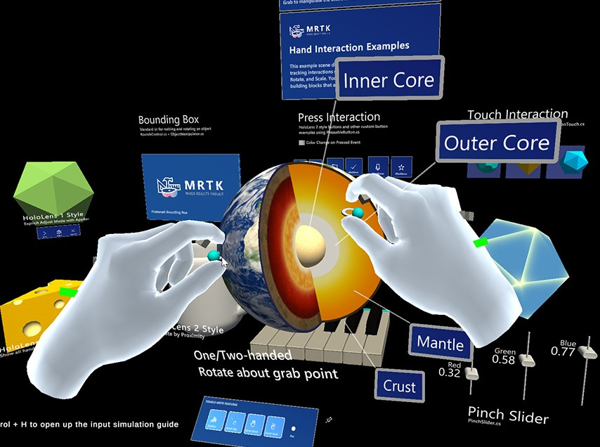
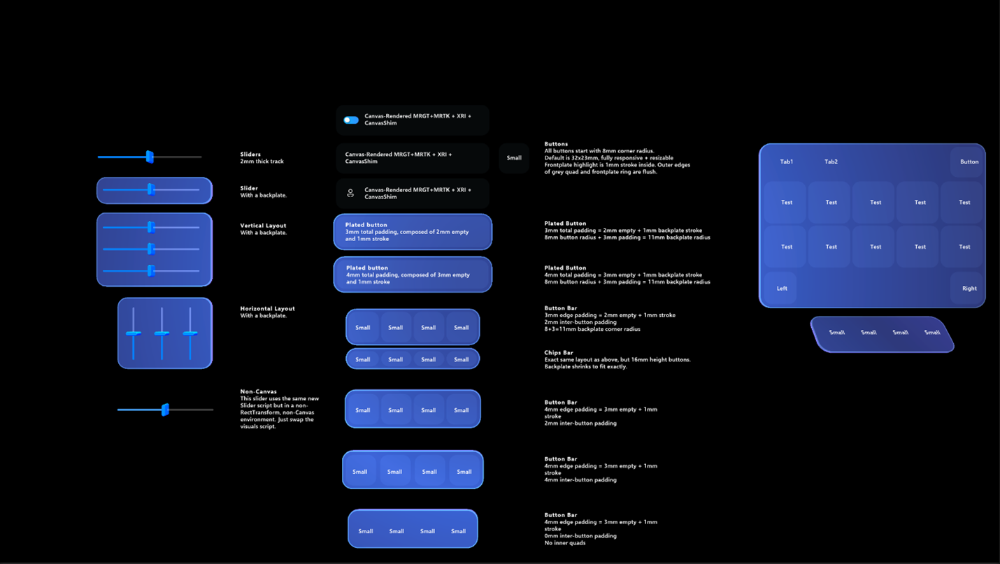

# Mixed Reality Toolkit 3 in-editor tutorials

The MRTK3 in-editor tutorials guide you through each step of the way to build your first MRTK3 application in a beautiful Aqaurium. 

## Getting Started with the MRTK3 in-editor tutorials

* Install Unity 2021.3.4f1
* Clone this repository to your computer
* Open the freshly cloned repository with Unity 2021.3.4f1
* Select an MRTK3 tutorial to start in the tutorial menu.

## Tutorials

### How to use MRTK3 Input Simulation

Learn how to simulate input directly into the editor.

### Object Manipulator

Move and manipulate objects with one or two hands with a wide variety of input modalities.

### Bounds Control

Intent feedback and precision manipulation affordances.

### Button

A volumetric button optimized for a wide range of input modalities.

### Volumetric UI with Canvas

Enables you to seamlessly create beautiful UI holograms with the ability to automatically lay out UI controls and quickly iterate your designs, until your UI is just right.

### Dialog

Prompt for various user action.

### Theming

A set of various assets and styles needed to achieve a specific visual aesthetic.
